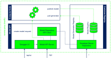

# REFORMERS Digital Twin Model API & Container Regsitry

This repository provides the configuration for deploying the **Model API** & **Container Regsitry** for the [REFORMERS] Digital Twin.
The Container Registry stores container images of model generators and models.
The Model API enables users / services to retrieve information about available model generators and models and helps automating associated workflows.



## Installation

1. Provide **server private key** (`server.key`) and **certificate** (`server.crt`) in sub-directory `./certs`.
   For testing, you may use the following to generate private key and certificate:
   ``` bash
   mkdir certs && cd certs
   openssl genrsa -out server.key 2048
   openssl req -new -x509 -sha256 -key server.key -out server.crt -days 3650
   ```
2. Provide **authorization config file**:
   + Get your access credentials encoded in base64:
     ```
     echo -n <USER_NAME>:<USER_PASSWORD> | base64
     ```
   + Create a JSON file with the following content, using the previously generated base64-encoded credentials:
     ```
     {
         "auths": {
             "<HOSTNAME>": {
                 "auth": "<BASE64-CREDENTIALS>"
             },
             "<HOSTNAME>:8082": {
                 "auth": "<BASE64-CREDENTIALS>"
             },
             "<HOSTNAME>:8083": {
                 "auth": "<BASE64-CREDENTIALS>"
             }
         }
     }
     ```
   For testing, you can use file [`auth-config.json.example`](./auth-config.json.example).
3. Define the following **environment variables** (e.g., via file `.env`):
   + `HOSTNAME`: host name of the server (example: *reformers-dev.ait.ac.at*)
   + `KEY_FILE`: server private key file (example: */certs/server.key*)
   + `CERT_FILE`: server certificate file (example: */certs/server.crt*)
   + `REPO_ADMIN_PASSWORD`: password for administrator account
   + `USER_NAME`: user name for default user account
   + `USER_PASSWORD`: password for default user account
   + `USER_FIRST_NAME`: first name for default user account
   + `USER_LAST_NAME`: last name for default user account
   + `USER_EMAIL`: e-mail address name for default user account
   + `AUTH_CONFIG_FULL_PATH`: full path to authorization config file
   For testing, you can use file [`.env.example`](./.env.example).
4. Start the service:
   ``` bash
   docker compose pull
   docker compose build
   docker compose up -d
   ```

*NOTE*:
The instructions above create a self-signed certificate.
This will cause browsers and other software to complain about security risks.

## Usage

### Model API

The Model API is available at: `https://<HOSTNAME>/api`

A graphical user interface (Swagger UI) for the Model API is available at: `https://<HOSTNAME>/api/ui`

### Model generators - container images

#### Push

_ATTENTION_: Pushing an image requires a login first.

Container image registry for model generators (port 8082):
```
docker login <HOSTNAME>:8082
docker push <HOSTNAME>:8082/generator1:v1
```

#### Pull

Container image registry for model generators (port 8082):
```
docker pull <HOSTNAME>:8082/generator1:v1
```

### Models - container images

#### Push

_ATTENTION_: Pushing an image requires a login first.

Container image registry for models (port 8083):
```
docker login <HOSTNAME>:8083
docker push <HOSTNAME>:8083/generator1/v1/model1:latest
```

#### Pull

Container image registry for models (port 8083):
```
docker pull <HOSTNAME>:8083/generator1/v1/model1:latest
```

## Troubleshooting

### Login to Docker repositories fails

_Error message_: `tls: failed to verify certificate: x509: certificate signed by unknown authority`

_Solution_: Add the following to the Docker daemon configuration file (change `HOSTNAME` accordingly):
```json
"insecure-registries": [
  "https://<HOSTNAME>:8082",
  "https://<HOSTNAME>:8083"
]
```

## Funding acknowledgement

 This development has been supported by the [REFORMERS] project of the European Union’s research and innovation programme Horizon Europe under the grant agreement No.101136211.

[REFORMERS]: https://reformers-energyvalleys.eu/
